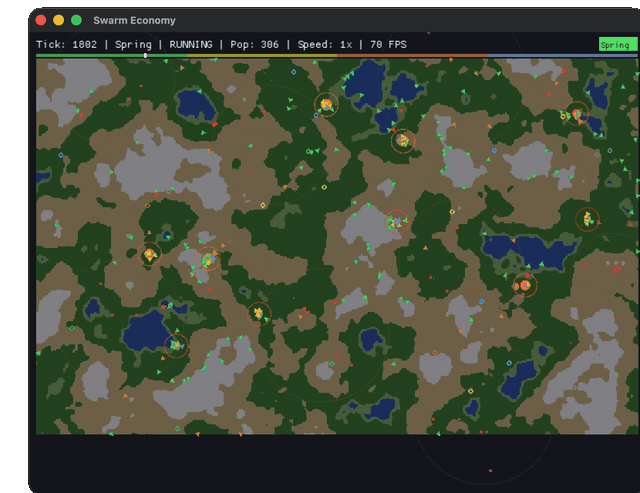

# Swarm Economy

An emergent market economy simulation built entirely by [attocode](https://attocode.com)'s **swarm mode** -- a multi-agent AI coding system that decomposes a goal into a dependency DAG of tasks, farms them to parallel worker agents, and merges the results.

14,000 lines of Rust. 17 tasks. 119 minutes. Zero human-written code.



## What It Does

Hundreds of autonomous merchant agents inhabit a procedurally-generated 2D world with cities, terrain, resources, and bandit camps. Each agent follows simple local rules (buy low, sell high, avoid danger, rest when tired) that produce complex emergent behavior:

- **Trade route formation** -- merchants wear paths between profitable cities
- **Price convergence** -- gossip spreads price information, arbitrage narrows margins
- **Caravan formation** -- sociable merchants cluster for bandit protection
- **City specialization** -- crafting bonuses drive regional industry
- **Seasonal cycles** -- winter shuts down farming/shipping, alters supply chains
- **Bandit ecosystems** -- camps spawn in forests, soldiers patrol roads

### Professions

| Profession | FSM States | Role |
|---|---|---|
| **Trader** | Scouting, Buying, Transporting, Selling, Resting, Fleeing | Arbitrage between cities |
| **Miner** | TravelingToNode, Extracting, TravelingToCity, Selling, Resting | Ore/Clay extraction |
| **Farmer** | TravelingToNode, Extracting, TravelingToCity, Selling, Resting | Grain/Herbs/Fish (seasonal) |
| **Craftsman** | BuyingMaterials, Crafting, SellingGoods, Resting | 3-tier recipe tree (16 recipes) |
| **Soldier** | Patrolling, Escorting, Fighting, Resting | Road patrol, caravan escort |
| **Shipwright** | Loading, Sailing, Unloading, Resting | Coastal bulk trade (2x speed, 3x carry) |
| **Idle** | Idle | Awaits profession assignment |

## Running

```bash
# GUI mode (default)
cargo run --release -- --seed 42

# Headless mode -- outputs JSON metrics report
cargo run --release -- --headless --ticks 10000 --seed 42

# Tests (195 unit + integration tests)
cargo test
```

### Controls (GUI)

- **Space** -- Pause/Resume
- **+/-** -- Speed up/slow down
- **Arrow keys** -- Pan camera
- **Scroll** -- Zoom
- **Home** -- Reset camera

## Architecture

```
src/
  brain/          # Per-profession FSM brains (trader, miner, farmer, ...)
  agents/         # Merchant struct, physics, sensory, caravans, economy manager
  market/         # Order books, crafting engine, gossip system
  world/          # Terrain, cities, reputation grid, roads, bandits, resources
  metrics/        # Emergence detection, inequality metrics, tracker
  rendering/      # macroquad renderer, HUD, price charts, overlays
  types.rs        # Shared enums/structs (Commodity, AgentState, Vec2, ...)
  config.rs       # TOML config loader with validation
```

## How It Was Built: attocode Swarm Mode

The entire codebase was generated in a single swarm run from a ~5000-word goal document (`tasks/goal.md`).

### Swarm Configuration

The swarm used a **hybrid topology** (`.attocode/swarm.hybrid.yaml`):

| Role | Count | Purpose |
|---|---|---|
| **Orchestrator** | 1 | Reads the goal, decomposes into a task DAG, schedules batches |
| **Impl workers** | 5 | Write code in parallel (shared-RO workspace, write access) |
| **Judge** | 1 | Reviews completed work against acceptance criteria |
| **Merger** | 1 | Resolves conflicts between parallel workers |

### Task Decomposition

The orchestrator produced **17 tasks** organized into a 9-level dependency DAG:

```
Level 1: task-1  Project scaffold, types, config
Level 2: task-2  Terrain system (Perlin noise)
         task-3  Reputation + road grids
         task-4  City system
         task-7  Crafting system
Level 3: task-5  Resource nodes
         task-6  Market engine (order books)
         task-8  Merchant core (physics, traits)
Level 4: task-9  Gossip + caravans
         task-10 Bandit system
Level 5: task-11 Brain FSMs (all 7 professions)
Level 6: task-12 Economy manager + world integration
Level 7: task-13 Rendering + HUD
         task-14 Metrics + headless mode
         task-15 Unit test suite
         task-16 Integration + emergence tests
Level 8: task-17 Final review (judge)
```

Where the DAG allowed, tasks ran in parallel (up to 4 concurrent workers). Total wall-clock time: **~2 hours** for the full 14k-line codebase.

### What Had to Be Fixed After Swarm

The swarm produced a compiling, mostly-working codebase, but one critical runtime bug required a post-swarm fix:

**Stack overflow from mutual recursion in brain FSMs** (all 6 profession brains):

The swarm-generated brain code used direct sibling calls for state transitions:
```rust
// BEFORE (swarm-generated) -- recursive sibling calls
fn scouting(&self, sensory, merchant) -> MerchantAction {
    if at_city && profitable_route {
        merchant.state = AgentState::Buying;
        return self.buying(sensory, merchant);  // direct call!
    }
    // ...
}
```

When conditions created ping-pong between states (e.g., Scouting -> Buying -> Scouting when no profitable buy exists), the call stack grew unboundedly and crashed.

**Fix**: Loop-based re-dispatch in `decide()`:
```rust
// AFTER -- loop re-dispatch, no recursion
fn decide(&self, sensory, merchant) -> MerchantAction {
    for _ in 0..8 {  // max 8 same-tick transitions
        let prev = merchant.state;
        let action = match merchant.state {
            AgentState::Scouting => self.scouting(sensory, merchant),
            // ...
        };
        if merchant.state == prev { return action; }
        // state changed -- re-dispatch via loop
    }
    MerchantAction::default()  // safety fallback
}

fn scouting(&self, sensory, merchant) -> MerchantAction {
    if at_city && profitable_route {
        merchant.state = AgentState::Buying;
        return MerchantAction::default();  // signal re-dispatch
    }
    // ...
}
```

This preserves same-tick state transitions (no wasted ticks) while preventing stack overflow. Applied to all 6 brain files (`trader.rs`, `miner.rs`, `farmer.rs`, `craftsman.rs`, `soldier.rs`, `shipwright.rs`).

## Guide to Swarm Traces

After a swarm run, all artifacts live in `.agent/hybrid-swarm/`:

```
.agent/hybrid-swarm/
  swarm.manifest.json     # Full config + goal + task DAG (read-only after decomposition)
  swarm.state.json        # Live state: task statuses, assignments, retries
  swarm.events.jsonl      # Chronological event log (spawn, complete, error, ...)
  coordinator.log         # Orchestrator decisions + scheduling
  control.jsonl           # Control signals (pause, resume, abort)
  tasks/
    task-task-1.json      # Per-task metadata: title, deps, status, result_summary
    task-task-2.json
    ...
  agents/
    agent-task-1.prompt.txt   # The full prompt sent to each worker
    agent-task-1.trace.jsonl  # Complete tool-call trace (every read, write, bash)
    agent-task-3.activity.txt # Human-readable activity summary (if available)
    ...
  changes.json            # Aggregated file changes across all workers
  worktrees/              # Git worktrees used by workers (cleaned up after merge)
  locks/                  # File-level locks for concurrent write coordination
```

### Inspecting a Run

```bash
# Live tail of events during a run
attoswarm inspect .agent/hybrid-swarm --tail 80

# Check overall status
cat .agent/hybrid-swarm/swarm.state.json | python3 -m json.tool | head -20

# List all tasks with status
python3 -c "
import json, glob
for f in sorted(glob.glob('.agent/hybrid-swarm/tasks/task-task-*.json')):
    d = json.load(open(f))
    deps = ','.join(d.get('deps',[]))
    print(f\"{d['task_id']:8s} | {d['status']:6s} | {d['title']}\")
"

# Read a specific worker's activity
cat .agent/hybrid-swarm/agents/agent-task-11.activity.txt

# Count events by type
python3 -c "
import json
from collections import Counter
events = [json.loads(l) for l in open('.agent/hybrid-swarm/swarm.events.jsonl')]
for et, count in Counter(e['event_type'] for e in events).most_common():
    print(f'{et:12s} {count}')
"
```

### Starting a New Swarm Run

```bash
# Write your goal to a markdown file
vim tasks/goal.md

# Run the swarm
attocode swarm start .attocode/swarm.hybrid.yaml "$(cat tasks/goal.md)"

# Or use the convenience script
./scripts/run-swarm.sh
```

### Key Events in `swarm.events.jsonl`

| Event Type | Meaning |
|---|---|
| `info` | Status messages, batch scheduling, service init |
| `decision` | Orchestrator decisions (decomposition, scheduling) |
| `spawn` | Worker agent launched for a task |
| `complete` | Task finished successfully |
| `error` | Task failed (will be retried up to `max_task_attempts`) |
| `retry` | Task being retried after failure |
| `merge` | Merger resolving conflicts between workers |

## Configuration

All simulation parameters are in `economy_config.toml`. Key sections:

- **`[world]`** -- Map size, terrain seed, season length
- **`[city]`** -- Population range, tax range, warehouse capacity, upgrade costs
- **`[merchant]`** -- Initial/max population, speed, carry capacity, fatigue
- **`[bandit]`** -- Camp count, patrol radius, robbery range, steal percentages
- **`[reputation]`** -- Grid resolution, decay rate, diffusion rate
- **`[road]`** -- Decay rate, speed bonus
- **`[professions]`** -- Distribution ratios (must sum to 1.0)

## License

Generated by attocode swarm mode. See the project for licensing details.
